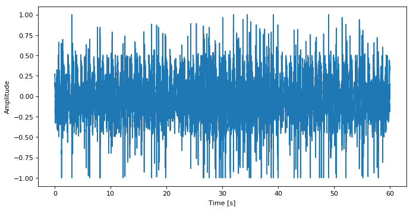
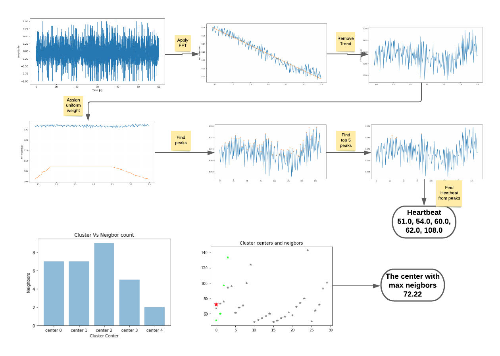
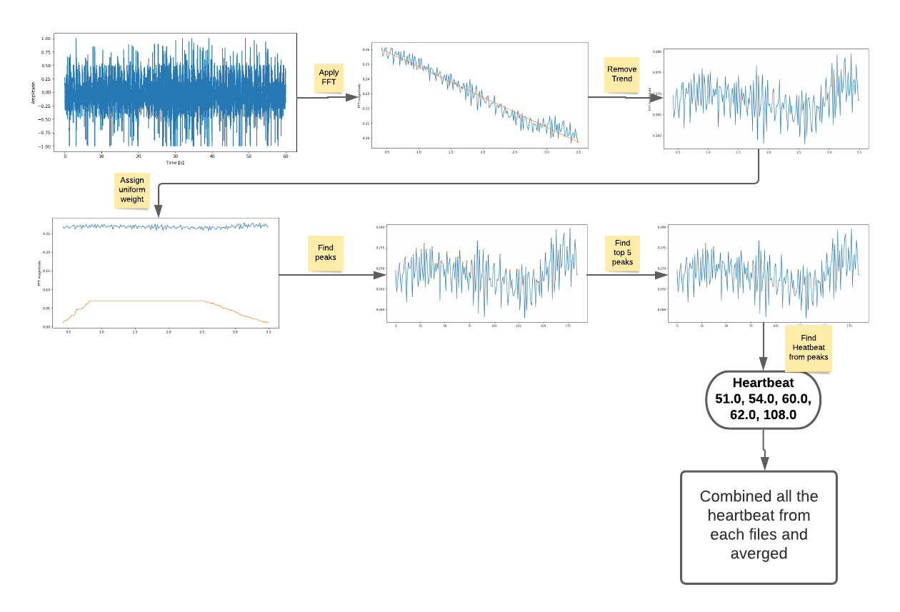

# Distinguish abnormal individuals from Neck Laser Data

Biomedical signal processing is one the most popular field in Digital Signal Processing. This involves analysis of signal measurements to provide useful information that can used to make clinical decisions. Engineers are discovering a new way to process these signals using a variety of mathematical formulae and algorithms. In this project work we are going to apply biomedicals signal processing technique on neck laser data, with machine learning to get remote sense of indvidual's health conditions.

Neck Laser data contains the human pulse vibrations over the neck artery collected by a Laser Doppler Vibrometer. Data file in .mat format. Each .mat file is the 1D signal values in the time spectrum like waves, electricity, mechanical vibrations etc. 

Neck laser original data is in time domain. In order to process this signal files, we first converted to frequency domain by Fast Fourier Transform (FFT). Then from signal in frequency domain we first derived heartbeat of each individual by two developed methods and took the heartbeat from the method with lowest error. Then we extracted peak frequencies in ranges 0~7hz, 2.6~10Hz, 11~20Hz, 21~30Hz, 31~40Hz and 41~50Hz from the signal in frequency domain, make each one as feature of an observation. 

We have extracted some features from original signal in time domain. Those are zero crossing rate average, spectral rolloff average, spectral centroid average, spectral bandwidth average, poly features average, rms average and spectral flatness average. 

After extracting Heartbeat and other features on all the files we have, we extracted the level mapping the ground truth we have. Although we have total of 39 observations but in ground truth file, we have 19 observations that matched the observation we have. So, Total of 19 observations we have to apply machine learning. 

As we know small data may have some issues in feeding model. Models may suffer from overfitting and high bias. So, we used TCGAN [3] to generate some synthetic data. Later used that synthetic data together with original data we feed our model. 

We developed four classification models. Those are AdaBoost, Decision Tree, KNN and Random Forest. We feed each model and with original data and synthetic plus original data separately. We saw that Adaboost (67% on original data and 71% on synthetic plus original data) is good choice. 

> The City College of NewYork, Fall 2020  
> DSE I9800: Capstone Project  
> Supervised by: Professor Jie Wei, email: jwei@ccny.cuny.edu  
> Submitted By: Md Ayub Ali Sarker, email: ayub.ali.sarker@gmail.com or msarker000@citymail.cuny.edu

## Project Structure
- **datasets** : Contains all the extracted features and intermediated processing file. Note that, there is no original file here in this folder. if any one needs original signal file, please contact to professor jie wie.
- **documents** : Contains all the reports and presentation.
- **experimental-notebooks**:  Contains all the jupyter notebooks that are used to processed signal file.
- **experimental-notebooks/Classifier**:  Contains all the jupyter notebooks that are used to processed.
- **pictures** : Contains all the pictures that are used in report and presentation.

## Hearbeat Extraction

Figure-1: Heartbeat extraction clustering approch

Figure-1: Heartbeat extraction average approch

### Details about Source Code
* **signal_utll.py**:  contains utility method used for processing signal.
* **find-top-peaks-and-hr-for-each-file_uniform-v2-in-0.8~2.5Hz.ipynb**: used to extract Heartbeat using clustering approach and average approch.
* **find-top-peaks-for-each-file-in-0~0.7Hz.ipynb23**: used to compute peack in the range 0~0.7Hz.
* **find-top-peaks-for-each-file-in-2.6~10Hz.ipynb**: used to compute peak in the range 2.6~10Hz.
* **find-top-peaks-for-each-file-in-11~20Hz.ipynb**:  used to compute peak in the range 11~20Hz.
- **find-top-peaks-for-each-file-in-21~30Hz.ipynb**: used to compute peak in the range 21~30Hz.
* **find-top-peaks-for-each-file-in-31~40Hz.ipynb**: used to compute peak in the range 31~40Hz.
* **find-top-peaks-for-each-file-in-41~50Hz.ipynb**: used to compute peak in the range 41~50H.
* **librosa-compute-poly_features.ipynb**: used to compute ploy feataure from the signal.
* **librosa-compute-rms.ipynb**: used to compute rms feature from the signal.
* **librosa-compute-spectral_bandwidth.ipynb**: used to compute spectral bandwidth from the signal.
* **librosa-compute-spectral_centroid.ipyn**: used to compute spectral centroid from the signal.
* **librosa-compute-spectral_flatness.ipynb**:used to compute spectral flatness from the signal.
* **librosa-compute-spectral_rolloff.ipynb**: used to compute spectral rolloff from the signal.
* **librosa-compute-zero_crossing_rate.ipynb**: used to compute zero crossing rate from the signal.
* **Classifier/finalize-dataset-heartbeat-and-peak-hz.ipynb**: used to merged all features data and heartbeat and make a final dataset.
* **Classifier/data-cleaning.ipynb**: little bit cleaned up and extraction of level.
* **Classifier/Feature-importance.ipynb**: used to find the important features.
* **Classifier/GAN-to-generate-10k-synthetic-data.ipynb**:  Generate 10K synthetic data usign TCGAN.
* **Classifier/GAN-to-generate-200-synthetic-data.ipyn**: Generate 200 synthetic data usign TCGAN.
* **Classifier/AdaBoostClassifier-Clasifier.ipynb**: used feed to adaboost original data.
* **Classifier/AdaBoostClassifier-Clasifier-200-synthetic-data.ipynb**: used feed to adaboost with 200 synthetic data plus original data.
* **Classifier/AdaBoostClassifier-Clasifier-10k-synthetic-data.ipynb**: used feed to adaboost with 10k synthetic data plus original data.
* **Classifier/Decission-tree-classifier.ipynb**: used feed to decission tree with original data.
* **Classifier/Decission-tree-classifier-200-synthetic-data.ipynb**: used feed to decission tree with 200 synthetic data plus original data.
* **Classifier/Decission-tree-classifier-10k-synthetic-data.ipynb**: used feed to decission tree with 10k synthetic data plus original data.
* **Classifier/KNN-Clasifier.ipynb**: used feed to KNN with original data.
* **Classifier/KNN-Clasifier-200-synthetic-data.ipynb**: used feed to KNN with 200 synthetic data plus original data. 
* **Classifier/KNN-Clasifier-10k-synthetic-data.ipynb**: used feed to KNN with 10k synthetic data plus original data. 
* **Classifier/RandomForest-Clasifier.ipynb**: used feed to Random forest with original data.
* **Classifier/RandomForest-Clasifier-10k-synthetic-data.ipynb**: used feed to Random forest with 200 synthetic data plus original data. 
* **Classifier/RandomForest-Clasifier-200-synthetic-data.ipynb**: used feed to Random forest with 10k synthetic data plus original data. 
* **Classifier/LogisticRegression-Clasifier.ipynb**: used feed to Logistic regression forest with original data.
* **Classifier/LogisticRegression-Clasifier-10k-synthetic-data.ipynb**: used feed to Logistic regression with 10k synthetic data plus original data.

## Detail documents
* **final presentation.pdf**:  final presentation.
* **DSE capstone project report-Neck Laser Data.pdf**: final project report.
